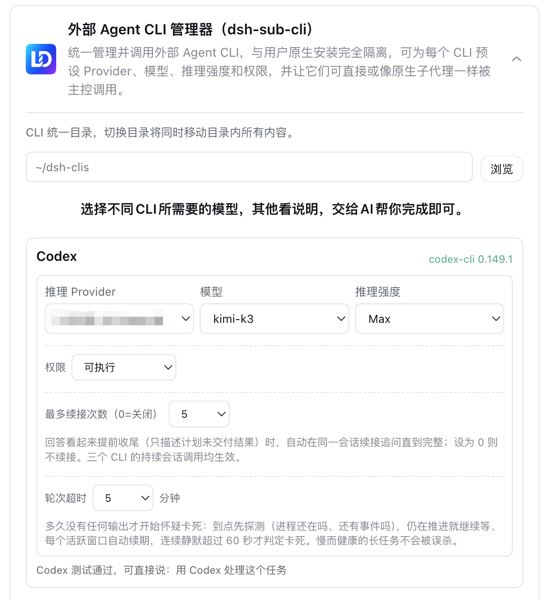

<p align="center">
  
</p>

# dsh-sub-cli

<p align="center">
  <a href="README.md">中文</a> ·
  <a href="plugin/README.en.md#install">Install</a> ·
  <a href="plugin/README.en.md#how-it-works">How it works</a> ·
  <a href="plugin/CHANGELOG.md">Changelog</a> ·
  <a href="https://github.com/dingminhua/dsh-sub-cli/issues">Feedback</a>
</p>

<p align="center">
  <a href="https://www.npmjs.com/package/dsh-sub-cli"></a>
  <a href="https://www.npmjs.com/package/dsh-sub-cli"></a>
  <a href="https://github.com/dingminhua/dsh-sub-cli/actions/workflows/ci.yml"></a>
  <a href="LICENSE"></a>
  <a href="https://github.com/dingminhua/dsh-sub-cli/stargazers"></a>
  <a href="https://dshfind.com/plugins/dingminhua/dsh-sub-cli"></a>
</p>

An open-source plugin for DeepSeek Harness (DSH) that centrally manages external Agent CLIs.

- Puts Codex and Claude Code under one **managed directory** (default `~/dsh-clis`) without touching the system PATH (Qwen Code support was removed in 2026-09);
- Gives every CLI an **isolated config directory** pointed at via the CLI's own environment variable — your system-installed CLI configuration is never touched;
- The Web settings card configures the managed directory plus a **three-layer model route** (provider → model → reasoning effort) per CLI;
- Registers **`cli_codex_direct` / `cli_codex_subagent` / `cli_claude_direct` / `cli_claude_subagent`** tools so the DSH model hands tasks to the matching CLI and gets the answer back as a sub-session;
- Registers the **`cli_dispatch`** model tool for one-shot headless CLI invocation with output returned to the conversation.

## Product goal

The core problem: **DSH itself uses the DeepSeek model, but many users already have other Agent CLIs installed (Codex, Claude Code, etc.) and want DSH to use them too** (e.g. "have Claude Code look at this project").

The trouble is that each CLI has its own install location, config directory, and model settings — messy, and easy to mix with the user's system-wide install.

So this plugin must deliver five things:

1. **Managed layout** — keep the CLIs under one directory (default `~/dsh-clis` or `%USERPROFILE%\dsh-clis`), separate from anything on the system;
2. **Config isolation** — each CLI uses its own config directory; **never overwrite** the system install the user already has;
3. **Usable inside DSH** — the DSH model calls these CLIs via `cli_dispatch` / `cli_<cli>_direct` / `cli_<cli>_subagent` and gets the result back into the conversation. Each CLI independently configures its permission tier (read-only / executable, fixed at startup — no prompts, no runtime elevation); granted capabilities pass silently at runtime while ungranted ones are deterministically rejected and logged when triggered, with a clear error guiding the user to the settings card. The legacy read-only / workspace-writable / full three-tier presets auto-map to the matching capability combination;
4. **Feels like a subagent** — the session header shows each CLI's status; clicking into it enters its own conversation;
5. **Cross-platform** — works on both macOS and Windows, with separate adaptations for paths, system commands, and default directories.

## Confirmed main-UI interaction

The main UI does not expose a manual "new CLI task" workbench. The user only talks to the controller AI, and the controller decides whether to delegate to a CLI and generates a short work title.

CLI work reuses DSH's subagent child-session experience: under the current controller session, show the title, CLI product, and running status; click in to see history and output; supported providers can keep receiving user or controller messages and can stop the current turn; completion is reported back to the controller automatically. The plugin's settings page only handles install, configuration, auth hints, detection, and testing.

The current implementation registers its tools globally from the Host plugin — six per CLI (`cli_<cli>_direct` / `_followup` / `_status` / `_sessions` / `_interrupt` / `_subagent`) × 2 managed CLIs, plus `cli_dispatch`, the lifecycle tools `cli_check` / `cli_install` / `cli_test` / `cli_remove`, and the Relay-internal `managed_cli_submit` — and registers one `SubagentProvider` per managed CLI (`managed-codex-relay` / `managed-claude-relay`); the tools are available under any work mode by default (explicit tool allow-lists or deny rules still take priority). The Relay form dispatches via `ctx.subagents.start(managed-<cli>-relay, ...)` and returns the CLI output as a sub-session result; no LLM provider is registered, so the model picker stays clean. Title, status, and history are provided by the native subagent UI/runtime.

**Continued sessions:** the first turn (`cli_<cli>_direct`) returns a stable `sessionId`; later turns re-enter the same real thread via `cli_<cli>_followup` (Codex over a long-lived app-server connection, Claude over `stream-json` plus file-level `--resume` persistence). Session state is written to `sessions.json`, so the same thread can be reattached after a Host restart. See `CLI-MANAGER-DESIGN.md` and `CLI-MANAGER-HANDOFF.md` for the full constraints.

## Project layout

```
├── .github/workflows/ci.yml      # CI: tests + npm pack --dry-run
├── integration.mjs / prove.mjs   # top-level verification scripts
├── awesome-dsh-plugin-submission/ # marketplace submission metadata
├── reference/                    # legacy archive (not part of the npm package)
├── THIRD_PARTY_NOTICES.md        # third-party attributions & license notes
├── LICENSE                       # MIT
└── plugin/                       # npm package root
    ├── package.json
    ├── cordis.patch.yml
    ├── lib/
    │   ├── index.js              # Host entry
    │   ├── registry.js           # CLI registry + argv templates
    │   ├── paths.js              # managed dir + config isolation
    │   ├── status.js             # install / version detection
    │   ├── dispatch.js           # headless dispatch
    │   └── client.js             # Web settings card
    ├── test/                     # unit tests (node --test)
    ├── README.md / README.en.md
    ├── CHANGELOG.md
    └── LICENSE                   # MIT
```

## Documentation

1. `plugin/README.md` / `plugin/README.en.md` — user-facing package docs;
2. `plugin/PLUGIN_REQUIREMENTS.md` — dev red lines & structural requirements;
3. `DEVELOPMENT.md` — local-dev principles & suggested layout;
4. `RELEASING.md` — release process;
5. `CLI-MANAGER-HANDOFF.md` / `CLI-MANAGER-DESIGN.md` — requirements & research (historical);
6. `CLI-AGENT-REFERENCE-RESEARCH.md` — round-1 architecture, permissions, and evolution notes for four external Agent-CLI projects;
7. `CLI-AGENT-FRAMEWORK-RESEARCH.md` — follow-up research on generic subagent frameworks, role catalogs, external engines, the official Claude Provider, and DAG orchestration;
8. `CLI-AGENT-ROADMAP.md` — final goals, architecture, capability contracts, milestones, and current acceptance criteria;
9. `MIGRATION-INVENTORY.md` — migration inventory of legacy project materials;
10. `reference/dsh-subagent-default-model/` — archived legacy reference, not part of the npm package;
11. `THIRD_PARTY_NOTICES.md` — third-party attributions and license notes.

## Acknowledgements

This plugin builds on work others have published. Sources and licenses are credited honestly below; we hold that in genuine respect.

### Principal reference for multi-CLI management and the Relay subagent

- [dingminhua/dsh-subagent-default-model](https://github.com/dingminhua/dsh-subagent-default-model) (MIT, Copyright (c) 2026 LaoDing) — **the principal reference for this project.** The multi-CLI registry, argv templates, three-layer model route, isolated config directory, the `managed_cli_submit` Relay-subagent shape, the DSH Web card styling, and the npm release engineering were all studied from it and independently reimplemented. The local `reference/dsh-subagent-default-model/` directory in this repository is the archived implementation of that project; it is consulted only during local development and is not shipped in the npm package.

### Reference for external-CLI dispatch

- [MJorgin/dsh-agent-conductor](https://github.com/MJorgin/dsh-agent-conductor) (MIT, Copyright (c) 2026 MJorgin) — `subprocess.spawn`-based headless dispatch of 11 external Agent CLIs in a DSH session. The argv-array dispatch, timeout and error reporting, and exit-code handling in this plugin were refined against its implementation.

### Protocol research (not on the main path)

- [wujfeng712-ui/codex-bridge](https://github.com/wujfeng712-ui/codex-bridge) (MIT) — Responses API ↔ Chat Completions two-way translation with `previous_response_id` resume, recorded during research as an alternative protocol path. **It is not referenced on the main path**; no source or binary dependency is taken from it.

### Note

Copyright in each project above belongs to its respective author. This project follows a **learn-the-design, write-our-own-code** approach and does not copy any reference project's source wholesale; key modules are written independently and each file's header comment names the specific project and pattern it draws on. If you find an attribution missing or incorrect, please open an issue and we will correct it promptly.

## Third-party open-source dependencies

The open-source projects referenced here, together with their licenses and compliance notes, are recorded in full in [THIRD_PARTY_NOTICES.md](THIRD_PARTY_NOTICES.md). When introducing new external dependencies or reusing code from other projects, update that file and honor the upstream licenses.

## Development & verification

```bash
node integration.mjs   # registry / paths tests
node prove.mjs         # dispatch / status tests
cd plugin && npm test  # full unit tests (offline mock)
cd plugin && npm pack --dry-run
```

**End-to-end battle testing has no standalone script** (the former `e2e-live.mjs` and the `verify-matrix/` series were deleted on 2026-09-04 — scripts that spawn CLI processes directly hang real sessions and bypass the harness tool layer's permission gating, audit trail, and session management). The canonical flow lives in `plugin/VERIFICATION-FLOW.md` and is driven by the captain inside a DSH session using the plugin's registered tools:

1. **Write**: `cli_codex_subagent` / `cli_claude_subagent` (relay subagents) each write a cipher only the captain knows to disk (UTF-8, no trailing newline, fixed byte length);
2. **Cross-read**: `cli_codex_direct` / `cli_claude_direct` (continued sessions) recite both files 2×2, proving the bytes really landed on disk and both CLIs read the same content;
3. **Delete**: relay subagents delete the files written in stage one; the captain independently verifies no residue on disk.

The captain's on-disk byte check is the only verdict (CLI self-reports are not trusted); a stage only advances after every subagent's completion. Write/delete need the CLI switched to the executable tier in the settings card; under the read-only tier writes are deterministically rejected and honestly reported — itself a valid data point for the permission gate (verified 2026-09-04: the Codex relay under read-only had all five write attempts blocked by its sandbox, both escalation requests auto-rejected, and the relay honestly reported "not created" with zero files on disk).

## License

This project is licensed under the MIT License, Copyright (c) 2026 LaoDing. See [LICENSE](LICENSE).
